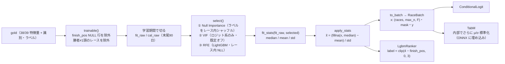

# 地方競馬 予測システム 特徴量エンジニアリング前後のスキーマ詳細設計書

対象範囲: 原本 CSV（bronze）→ silver → as-of 特徴量（gold）→ モデル入力 → 運用 DWH / 推論入力 の、**全列の定義と変換**
位置づけ: 処理の流れは `Design_LogicFlow.md`、設計判断の理由は `Design_Modeling.md` §4〜§6 / `Design_Operation.md` §2〜§3。本書は「この列はどこから来て、どう計算され、NULL は何を意味し、実データでどう分布しているか」を引くための辞書。
基準コード: 2026-09-16 時点の `main`（d1b181a）

---

## 0. 読み方と計測条件

### 0.1 計測条件

| 項目 | 値 |
|---|---|
| データ | `learning/data_real`（silver・gold とも 2026-09-03 生成） |
| 期間 | 1998-01-01 〜 2026-09-06（odds のみ 2026-02-02 〜 2026-09-02） |
| gold の同一性 | `content_hash.txt` = 平地 `b50ea94e…` / ばんえい `b49cf81f…`。現行リリースの `dataset_version` と一致 |
| silver の統計 | 全期間 |
| **gold の特徴量統計** | **2024-02-01 より前の行のみ**（平地 4,001,818 行 / ばんえい 425,010 行）。OOS 区間（`conf/cv.yaml` で施錠）の分布は見ていない |
| 欠損率の定義 | NaN / None、および文字列列では空文字・空白のみ。silver の文字列列で「空文字 = 欠損」になっている列が多いので、`isna()` だけだと過小評価になる |
| 計測スクリプト | 本書作成時のアドホック実行（リポジトリには含めていない） |

### 0.2 記法

- **前 / 後**: 「前」は変換の入力列、「後」は出力列。
- **as-of 窓**: 特に断りがなければ `PARTITION BY <キー> ORDER BY start_ts GROUPS BETWEEN UNBOUNDED PRECEDING AND 1 PRECEDING`。すなわち「同じキーで、**発走時刻が厳密に前**の全行」（同時刻の他場レースも除外）。以下「過去全行」と書く。
- **採用**: 現行配布物の `feature_spec.names` に含まれるか。平地 = `v2026.09.05-B`（`current.json`）、ばんえい = `v2026.08.30-A-banei`（`current_banei.json`）。
- 欠損率・分位点は「平地 / ばんえい」の順。`—` はその系統に列が無い。

---

## 1. 層ごとの粒度とキー

| 層 | テーブル | 1行の意味 | 主キー | 行数（実測） | 重複キー |
|---|---|---|---|---|---|
| bronze | `race/ym=*/part-00` | レース | （無し。全列 str） | — | — |
| bronze | `entry/ym=*/part-00` | 出走馬（取消・除外を含む） | （無し） | — | — |
| bronze | `payout/ym=*/part-00` | レース（払戻横持ち） | （無し） | — | — |
| bronze | `odds/ym=*/part-01..03` | 券種×組番 | （無し） | — | — |
| silver | `race` | レース | `race_id` | 487,095 | 0 |
| silver | `entry` | 出走馬 | `(race_id, horse_no)` | 4,835,353 | 0 |
| silver | `payout` | 払戻1件（券種×組番×同着通番） | `(race_id, bet_type, comb_1..3)` | 4,848,425 | 0 |
| silver | `odds` | 単勝オッズ1件 | `(race_id, horse_no)` | 90,737 | 0 |
| gold | `features_noodds` | 出走馬（平地） | `(race_id, horse_no)` | 4,367,821 | 0 |
| gold | `features_noodds_banei` | 出走馬（ばんえい） | `(race_id, horse_no)` | 467,049 | 0 |
| 運用 | `entry_result_final` | 出走馬（確定層） | `(race_id, horse_no)` | 約480万 | — |
| 運用 | `feature_snapshot` | 推論時の出走馬×リリース | `(as_of_date, race_id, model_release, horse_no)` | 1日 約1,000 | — |

行数の突き合わせ: silver `entry` 4,835,353 = gold 平地 4,367,821 + gold ばんえい 467,049 + **483**。483 行は `race_id` が silver `race` に存在しない出走行で、ビルダーの `JOIN race_raw USING (race_id)` で黙って落ちる（§10 所見 Q-1）。

### 1.1 キーの作り方

| キー | 定義 | 実装 |
|---|---|---|
| `race_id` | `f"{baba_code:02d}{YYYYMMDD}{race_no:02d}"`（12桁） | `transform.keys.make_race_id` |
| `baba_code` | 競馬場名 → コード。`meta/track_master.json`（廃止場含む31場）。未知名は `UnknownTrackError` | `keys.TrackMaster` |
| `horse_sk` | `sha256("馬名\x1f生年月日\x1f父馬名")[:16]`（各要素の空白を除去） | `keys.horse_sk` |
| `jockey_sk` / `trainer_sk` | 氏名の空白除去のみ（所属を含めない＝移籍で履歴が切れない） | `keys.person_keys` |
| `jockey_affil_sk` / `trainer_affil_sk` | `氏名@所属`（silver には残すが特徴量では未使用） | 同上 |
| `sire_sk` / `dam_sk` | 父馬名 / 母馬名の前後空白除去 | `silver.build_entry` |

実測のカーディナリティ（silver `entry`）: `horse_sk` 174,794 / `horse_name` 169,117（同名別馬・改名の差）/ `jockey_sk` 1,557 / `trainer_sk` 1,974 / `sire_sk` 3,978。

---

## 2. bronze（変換前）→ silver の列対応

bronze は「ZIP 展開 + デコード（BOM 判定 → utf-8-sig → cp932 → cp932/replace）」だけで、**全列が文字列**のまま（`transform/bronze.py::to_frame`）。列数はスキーマガードが固定（race 66 / entry 36 / payout 54 / odds 10、`schema_guard.EXPECTED_COLUMNS`）。

### 2.1 レース一覧 `racelist`（66列）→ silver `race`（16列）

| bronze 列 | 生値の例（2026-07） | silver 列 | 変換 | 扱い |
|---|---|---|---|---|
| 競馬場 | `帯広ば` `盛岡` `浦和` | `track_name`, `baba_code` | そのまま / `TrackMaster.codes` | キー |
| 競走年月日 | `20260704` | `race_date` | `%Y%m%d` → date | キー |
| レース番号 | `1` | `race_no` | 数字抽出 → Int64 | キー |
| 発走時刻 | `1430` | `start_ts` | `race_date + HH:MM`（解析不能は 12:00）。**JST の naive** | as-of の順序 |
| 競走種類名称 | `普通` `一般` `特別` `重賞` `準重賞` | `class_name`, `class_level` | `_class_level`: 新馬/未勝利=1, 普通/一般=2, 特別=4, 重賞/Ｇ/G1-3/JpnI=5, それ以外=3 | 特徴量 |
| レース名 | | `race_name` | そのまま | 未使用 |
| 副賞名1〜15 | | — | 捨てる | — |
| 芝ダート区分 | `ダート` `芝` | `surface` | そのまま | 未使用 |
| 回り | `左` `右` `直` | `turn` | そのまま | `d_turn_*` の選択条件 |
| 距離 | `1200` `200` | `distance` | 数字抽出 | 特徴量・speed_index のグループ |
| 天候 | `晴` `曇` | `weather` | そのまま | 未使用（運用時は当日値が必要な列） |
| 馬場 | 平地 `良` `稍重`… / ばんえい `0.9` `3.0` | `baba_condition` | そのまま | ばんえい `b_moisture` |
| 頭数 | `10` | — | リネーム後に捨てる | **post-race 扱い**（取消の反映時点が不明。頭数は出馬表の行数で数える） |
| 条件 | `混合　３歳以上 規定` | `condition_name` | そのまま | 未使用 |
| 1着賞金(円) | `330000` | `prize_yen` | 列名に「本賞金」または「賞金」と「1」を含む最初の列 → 数値。欠損は列中央値、列が無ければ 1,000,000 | `log_prize` |
| 2〜5着賞金(円) | | — | 捨てる | — |
| 上がり4F / 上がり3F | `37.7` | — | 捨てる | post-race |
| ハロンタイム1〜15 | `12.4` | — | 捨てる | post-race |
| コーナー名称1〜8 / コーナー通過順1〜8 | | — | 捨てる | post-race |

### 2.2 出馬表 `horselist`（36列）→ silver `entry`（41列）

| bronze 列 | 生値の例 | silver 列 | 変換 | 時点 | 用途 |
|---|---|---|---|---|---|
| 競馬場 / 競走年月日 / レース番号 | | `baba_code`, `race_date`, `race_no`, `race_id` | §2.1 と同じ | 前 | キー |
| 枠番 | `1` | `waku` | 数字抽出 | 前 | 未使用 |
| 帽色 | | — | 捨てる | | |
| 馬番 | `5` | `horse_no` | 数字抽出。**NaN 行は削除** | 前 | キー・`draw_rel` |
| 馬名 | | `horse_name`, `horse_sk` | §1.1 | 前 | キー |
| 性 | `牡` `牝` `セン` | `sex` | そのまま | 前 | ばんえい `b_is_female` / `b_is_gelding` |
| 齢 | `7` | `age` | 数字抽出 | 前 | ばんえい `b_age` |
| 毛色 | | — | リネーム後に捨てる | | |
| 生年月日 | `20190309` | `birth_ymd` | 文字列 | 前 | `horse_sk` |
| 父馬名 / 母馬名 / 母父馬名 | | `sire_sk`, `dam_sk`, `damsire_name` | 空白除去 | 前 | `s_*`（父のみ） |
| 騎手名 / 騎手所属 | | `jockey_name`, `jockey_sk`, `jockey_affil_sk` | §1.1 | 前 | `j_*`, `jt_*` |
| 負担重量 | `620` `☆580` | `weight_carried` | **文字列のまま**（減量印を保持） | 前 | ばんえい `b_weight_carried`, `b_is_apprentice` |
| 騎手成績 | `1-2-0-1` | `騎手成績` | 文字列のまま | 前（as-of-race 確定） | `d_pair_*` |
| 調教師 / 調教師所属 | | `trainer_name`, `trainer_sk`, `trainer_affil_sk` | §1.1 | 前 | `t_*`, `jt_*` |
| 馬主氏名 / 生産牧場名 | | — | リネーム後に捨てる | | |
| 馬体重 | `1051` | `weight_kg` | 数字抽出 → float | 前（当日発表） | ばんえい `b_body_weight` |
| 馬体重増減 | `+6` | `weight_diff` | 文字列のまま | 前（当日発表） | ばんえい `b_body_weight_diff` |
| 全成績 | `9-22-14-85` | `全成績` | 文字列のまま | 前（as-of-race 確定） | `d_all_*` |
| ダート左成績 / ダート右成績 | `6-6-6-28` | 同名 | 文字列のまま | 前（同上） | `d_turn_*` |
| 当競馬場成績 | | 同名 | 文字列のまま | 前（同上） | `d_track_*` |
| うち当距離成績 | | 同名 | 文字列のまま | 前（同上） | `d_dist_*` |
| 最高タイム | `1:22.1` | 同名 | 文字列のまま | 前（同上） | `d_best_speed` |
| 最高タイム良馬場 | `良1:10.6` | 同名 | 文字列のまま（馬場ラベル前置） | 前（同上） | `d_best_speed_good` |
| **着順** | `3`（取消等は空欄） | `finish_pos`, `is_win` | 数字抽出（非数値 → NaN）/ `finish_pos == 1` | **後** | ラベル・as-of 集計の材料 |
| **タイム** | `1505`（= 1:50.5） | `time_sec` | `MSSF` 詰め形式 or `M:SS.f` → 秒 | **後** | speed_index・pace_balance の材料 |
| **着差** | `出走取消` `同着` | `margin` | 文字列のまま | **後** | 未使用 |
| **上がり3F** | `37.7` | `last3f` | **文字列のまま**（数値化は運用投入時とビルダー内） | **後** | pace_balance の材料 |
| **人気** | `7` | `popularity` | 数字抽出 | **後**（市場情報） | 評価の人気帯別 ECE のみ |
| — | | `start_ts`, `distance`, `class_level`, `prize_yen` | `attach_start_ts`: race から LEFT JOIN | | as-of 順序・特徴量 |

「後」の列は silver に**残す**。ラベルと過去走の集計に必要で、リークは「対象レース行の特徴量に入れない」ことで防ぐ（§4）。

### 2.3 払戻 `payback`（54列）→ silver `payout`（9列、縦持ち）

`silver._PAYBACK_LAYOUT` が券種ごとの列配置を明示的に持つ。

| 券種 | 組番の列 | 払戻の列 | 人気の列 | 同着通番 |
|---|---|---|---|---|
| 単勝 | 単勝組番 | 単勝払戻金（円） | 単勝人気 | 1 |
| 複勝 | 複勝組番{1..3} | 複勝払戻金{1..3}（円） | 複勝人気{1..3} | 1〜3（3頭ぶん） |
| 枠連 / 枠単 | 枠複（単）組番1, 2 | 枠複（単）払戻金（円） | 枠複（単）人気 | 1 |
| 馬連 / 馬単 | 馬複（単）組番1, 2 | 馬複（単）払戻金（円） | 馬複（単）人気1 | 1 |
| ワイド | ワイド組番{1..3}馬番1, 2 | ワイド払戻金{1..3}（円） | ワイド人気{1..3} | 1〜3 |
| 3連複 / 3連単 | ３連複（単）組番馬番1..3 | ３連複（単）払戻金（円） | ３連複（単）人気 | 1 |

後: `race_id, race_date, bet_type, comb_1, comb_2, comb_3, payout_yen, popularity, dead_heat_seq`。券種別件数（実測）: 複勝 1,396,028 / ワイド 907,035 / 単勝 485,180 / 馬連 447,478 / 馬単 414,378 / 枠連 395,631 / 3連単 318,817 / 3連複 317,327 / 枠単 166,551。**特徴量には使わない**（EDA Q6 の控除率実測・経済評価用）。

### 2.4 オッズ `odds`（10列）→ silver `odds`（5列）

| bronze 列 | 生値の例 | silver 列 | 変換 |
|---|---|---|---|
| 競馬場 / 競走年月日 / レース番号 | | `race_id`, `race_date` | §2.1 と同じ |
| 賭式 | `単勝` `３連単` | — | **単勝だけ残す**（`bet_types=("単勝",)`） |
| 番号1 | `1` | `horse_no` | 数字抽出 |
| 番号2 / 番号3 / オッズ（最大） | | — | 捨てる |
| オッズ | `26.3` | `odds_win` | 数字抽出。**0 以下の行は削除** |
| 人気 | `7` | `popularity` | 数字抽出 |

**これは確定オッズ**（払戻と全勝ち馬で一致）で、締切前オッズではない。トラックA の特徴量には入れない（`assert_no_market_info`）。用途はトラックB 残差モデルの検証と市場ベースラインだけ。

---

## 3. silver スキーマ（変換後の実測）

### 3.1 `race`（487,095 行）

| 列 | dtype | 欠損% | 種類数 | 備考 |
|---|---|---|---|---|
| race_id | str | 0 | 487,095 | 一意 |
| race_date | date | 0 | 10,467 | |
| start_ts | datetime64[ns]（JST naive） | 0 | 402,504 | |
| baba_code | int64 | 0 | 31 | |
| track_name | str | 0 | 31 | |
| race_no | Int64 | 0 | 12 | |
| distance | int64 | 0 | 53 | |
| surface | str | **17.92** | 3 | ダート 398,061 / 芝 1,749 / 空欄 87,285 |
| turn | str | 0 | 3 | 右 360,461 / 左 76,686 / 直 49,948（直 = ばんえい） |
| class_name | str | 0 | 5 | 普通 195,144 / 一般 193,697 / 特別 87,167 / 重賞 8,912 / 準重賞 2,175 |
| class_level | int64 | 0 | **3** | 2: 388,841 / 4: 87,167 / 5: 11,087（1 と 3 は0件） |
| prize_yen | int64 | 0 | 367 | |
| weather | str | 0.24 | 7 | |
| baba_condition | str | 0.02 | 131 | 平地は4水準、ばんえいは含水率の数値文字列 |
| condition_name | str | 0 | 165 | |
| race_name | str | 0 | 121,010 | |

### 3.2 `entry`（4,835,353 行）

| 列 | dtype | 欠損% | 種類数 | 備考 |
|---|---|---|---|---|
| race_id | str | 0 | 487,140 | うち 483 行は `race` に無い race_id |
| race_date | date | 0 | 10,467 | |
| baba_code | int64 | 0 | 31 | ばんえい（1-4）467,051 行 |
| race_no | Int64 | 0 | 12 | |
| horse_no | Int64 | 0 | 16 | |
| waku | int64 | 0 | 8 | |
| horse_sk | str | 0 | 174,794 | |
| horse_name | str | 0 | 169,117 | |
| birth_ymd | str | 0 | 6,053 | |
| sex | str | 0 | 4 | |
| age | int64 | 0 | 18 | |
| sire_sk | str | 0 | 3,978 | |
| dam_sk | str | 0 | 52,735 | |
| damsire_name | str | 0 | 4,625 | |
| jockey_sk / jockey_affil_sk / jockey_name | str | 0 | 1,557 / 2,035 / 1,570 | |
| trainer_sk / trainer_affil_sk / trainer_name | str | 0 | 1,974 / 2,033 / 1,977 | |
| weight_carried | str | 0 | 393 | 減量印つき文字列 |
| weight_kg | float64 | 1.10 | 890 | |
| weight_diff | str | 2.85 | 246 | |
| finish_pos | float64 | 1.55 | 16 | NaN 75,147 行（取消・除外・中止） |
| is_win | int64 | 0 | 2 | NaN 着順は 0 |
| time_sec | float64 | 1.53 | 2,885 | |
| popularity | float64 | 1.25 | 17 | |
| margin | str | 18.51 | 35 | |
| last3f | str | **44.77** | 355 | 古い年ほど欠測（1998〜2009 は 56〜94%、2010 以降 約12%） |
| 騎手成績 | str | 0 | 128,149 | |
| 全成績 | str | 0 | 468,542 | |
| ダート左成績 / ダート右成績 | str | 9.66 / 9.66 | | ばんえい行はほぼ空欄 |
| 当競馬場成績 / うち当距離成績 | str | 0 / 0 | | |
| 最高タイム | str | 26.38 | 1,492 | |
| 最高タイム良馬場 | str | 35.73 | 1,461 | |
| start_ts | datetime64[ns] | 0.01 | | race に JOIN できない 483 行が NaN |
| distance / class_level / prize_yen | float64 | 0.01 | | 同上（JOIN で float 化） |

レース単位の勝者数（`is_win` の和）: 1頭 484,089 / **0頭 2,392**（中止・未実施）/ **2頭 658**・3頭 1（1着同着）。学習時は `trainable()` が「勝者がちょうど1頭」のレースだけを残す。

### 3.3 `payout`（4,848,425 行）/ `odds`（90,737 行）

| テーブル | 列 | dtype | 欠損% |
|---|---|---|---|
| payout | race_id / race_date / bet_type | str / date / str | 0 |
| payout | comb_1 | int64 | 0 |
| payout | comb_2 / comb_3 | float64 | 38.80 / 86.88（券種の脚数による。欠損ではなく「該当なし」） |
| payout | payout_yen / dead_heat_seq | int64 | 0 |
| payout | popularity | float64 | 39.62 |
| odds | race_id / race_date / horse_no / odds_win / popularity | str / date / Int64 / float64 / int64 | 0 |

---

## 4. pre-race 境界（何を「発走前に分かる列」とみなすか）

`transform/prerace.py` が集合で強制する。**列名で判定**するので、bronze の日本語列名の時点で効く。

| 集合 | 列 | 扱い |
|---|---|---|
| `POST_RACE_ENTRY_COLS` | 着順, タイム, 着差, 上がり3F, 人気 | 対象レース行からは落とす |
| 同上（累積成績8列） | 騎手成績, 全成績, ダート左成績, ダート右成績, 当競馬場成績, うち当距離成績, 最高タイム, 最高タイム良馬場 | 既定は落とす側。ただし `ASOF_RACE_WHITELIST` に入っていれば残す |
| `POST_RACE_RACE_COLS` | 上がり4F, 上がり3F, ハロンタイム1〜15, コーナー名称1〜8, コーナー通過順1〜8, 頭数 | 落とす |
| `ASOF_RACE_WHITELIST` | 累積成績8列**すべて** | 2026-08 の LK-06/07/08（4,831,906 行）で as-of-race を確定（`artifacts/leak_verdict.json`）。当日の DebaTable にも同じ値が載る |
| `OPERATIONALLY_CONSTRAINED` | 天候, 馬場, 馬体重 | 発走前に分かるが、運用時は当日ページから取る必要がある |

注意点は、silver では着順などを**英語名にリネーム済み**（`finish_pos`, `time_sec`, `last3f` …）であること。`to_prerace()` は日本語名を見るので、silver の英語名の結果列は落とさない。これらの列が特徴量に漏れないのは、ビルダーの**ウィンドウが対象行を含まない**からであって、`to_prerace` のおかげではない（LK-05 が未来行の改ざんで検証）。推論時は当日ページに結果列そのものが無く、`to_prerace` + `assert_prerace` が二重の保険になる。

トラックA の市場情報ブロック（`conf/features.yaml` の `market_term_blocklist`）: 列名に `odds`, `オッズ`, `ninki`, `人気`, `support`, `支持率`, `payout`, `払戻`, `market`, `implied` を含むと `LeakageError`。

---

## 5. 中間派生列（特徴量の材料。gold には出ない）

| 列 | 粒度 | 定義 | 実装 |
|---|---|---|---|
| `speed_index` | 出走馬 | `-(time_sec − ref) / sd`。`ref` = 同じ (baba_code, distance, race_date) で**発走時刻が厳密に前**の走破時計の平均（当日の先行レース）。無ければ同じ (baba_code, distance) の過去全行の平均。`sd` = 同じ (baba_code, distance) の過去全行の標準偏差（不偏）。**過去件数 < 100 なら NaN**。速いほど正 | `builder.speed_index`（pandas の groupby 累積和。DuckDB を使わないのは加算順の非決定性のため） |
| `pace_balance` | 出走馬 | `last3f ∈ [30, 60]` かつ `distance > 600` かつ `time_sec > last3f` のとき `(time_sec − last3f) / ((distance − 600)/200) − last3f/3`、それ以外 NULL。秒/200m、負 = 前傾（逃げ・先行） | `builder._pace_balance_sql` |
| `n_runners` | レース | `COUNT(*) OVER (PARTITION BY race_id)`。**取消・除外の馬も数える**（出馬表の行数） | `builder.build` CTE `e` |

運用では `speed_index` を**確定層に保存済みの値**で使う（`refresh._to_bq_payload` が全履歴で計算して MERGE）。推論時に渡る履歴は部分集合なので、その場で計算し直すと別の値になるため。ライブ層（当日分）の `speed_index` は常に NaN。

---

## 6. 特徴量カタログ（変換後）

各表の「実測」は §0.1 の条件（2024-02-01 より前）。書式は `欠損% ／ p01 · p50 · p99`。

### 6.1 馬の過去成績（`h_*`、キー `horse_sk`）

| 特徴量 | 前（入力列） | 定義 | NULL の意味 | 平地 実測 | ばんえい 実測 | 採用 平地/ばんえい |
|---|---|---|---|---|---|---|
| `h_starts_prior` | entry 行 | 過去全行の `COUNT(*)`（**取消・除外も1走と数える**） | なし（初出走は 0） | 0 ／ 0 · 18 · 128 | 0 ／ 0 · 47 · 287 | ● / — |
| `h_wins_prior` | is_win | 過去全行の `SUM(is_win)`（NULL→0） | なし | 0 ／ 0 · 2 · 16 | 0 ／ 0 · 6 · 38 | — / ● |
| `h_winrate_prior` | is_win | 過去全行の `AVG(is_win)` | **初出走**（0 ではなく NULL。FE-02） | 3.81 ／ 0 · 0.083 · 0.833 | 1.65 ／ 0 · 0.118 · 0.5 | ● / ● |
| `h_top3rate_prior` | finish_pos | 過去全行の `AVG(finish_pos ≤ 3 ? 1 : 0)`（NULL 着順は 0） | 初出走 | 3.81 ／ 0 · 0.333 · 1.0 | 1.65 ／ 0 · 0.352 · 1.0 | ● / ● |
| `h_si_last3` | speed_index | `LAG(speed_index, 1..3)` の NULL を除いた平均。`w2` = `ORDER BY start_ts, race_id, horse_no` | 初出走、または直近3走がすべて NaN（場×距離の過去100走未満） | 4.19 ／ −2.24 · 0.39 · 3.31（min −68.5） | 1.77 ／ −2.41 · 0.22 · 2.21 | ● / ● |
| `h_best_si_prior` | speed_index | 過去全行の `MAX(speed_index)` | 初出走、または過去すべて NaN | 4.18 ／ −1.11 · 2.21 · 16.4 | 1.76 ／ −0.86 · 2.41 · 13.7 | — / — |
| `h_days_since_prev` | race_date | `DATE_DIFF('day', LAG(race_date) OVER w2, race_date)` | 初出走 | 3.81 ／ 6 · 15 · 184（max 2,785） | 1.65 ／ 3 · 12 · 70 | ● / ● |
| `is_first_start` | h_starts_prior | `h_starts_prior = 0 ? 1 : 0` | なし | 0 ／ 平均 0.038 | 0 ／ 平均 0.017 | — / — |
| `h_pace_bal_last3` | last3f, time_sec, distance | `pace_balance` の `LAG 1..3` の NULL 除外平均 | 初出走、直近3走すべて定義不能（上がり3F 欠測・600m 以下） | **42.79**（2010 以降 4.67）／ −1.81 · −0.49 · 0.81 | —（削除） | — / — |

### 6.2 騎手・調教師・組み合わせ・種牡馬

収縮式は `(wins + α·p̄) / (starts + α)`、**p̄ = 1 / 対象レースの `n_runners`**（`builder.py` の `prior`。データセット全体に依存しないので推論の部分集合でも一致する）。α は `conf/features.yaml` / `conf_banei/features.yaml`。

| 特徴量 | キー | 定義 | α（平地/ばんえい） | NULL | 平地 実測 | ばんえい 実測 | 採用 |
|---|---|---|---|---|---|---|---|
| `j_starts_prior` | jockey_sk | 過去全行の COUNT | — | なし | 0 ／ 31 · 3,199 · 20,210 | 0 ／ 58 · 5,135 · 22,219 | — / — |
| `j_winrate_shrunk` | jockey_sk | 収縮勝率 | 50 / 30 | なし（初騎乗は p̄） | 0 ／ 0.027 · 0.090 · 0.238 | 0 ／ 0.058 · 0.102 · 0.172 | ● / ● |
| `t_starts_prior` | trainer_sk | 過去全行の COUNT | — | なし | 0 ／ 22 · 2,084 · 14,520 | 0 ／ 53 · 4,485 · 17,641 | — / — |
| `t_winrate_shrunk` | trainer_sk | 収縮勝率 | 50 / 30 | なし | 0 ／ 0.035 · 0.102 · 0.235 | 0 ／ 0.076 · 0.104 · 0.145 | ● / — |
| `jt_starts_prior` | (jockey_sk, trainer_sk) | 過去全行の COUNT（**窓は無界**） | — | なし | 0 ／ 0 · 119 · 3,739 | 0 ／ 1 · 244 · 6,410 | — / — |
| `jt_winrate_wilson` | (jockey_sk, trainer_sk) | Wilson スコア 95% 下限 `(p + z²/2n − z·√(p(1−p)/n + z²/4n²)) / (1 + z²/n)`、z=1.96。n=0 は 0 | — | なし | 0 ／ 0 · 0.048 · 0.266 | 0 ／ 0 · 0.073 · 0.178 | ● / — |
| `s_starts_prior` | sire_sk | 過去全行の COUNT | — | なし | 0 ／ 15 · 2,796 · 22,181 | 0 ／ 5 · 638 · 11,060 | — / — |
| `s_winrate_shrunk` | sire_sk | 収縮勝率 | 30 / 20 | なし | 0 ／ 0.055 · 0.109 · 0.200 | 0 ／ 0.058 · 0.112 · 0.182 | — / — |

騎手・調教師は**氏名のみ**のキー（所属を含めない）。同一氏名の別人は区別されない。

### 6.3 レース条件（対象レース行そのものの属性。窓なし）

| 特徴量 | 前 | 定義 | NULL | 平地 実測 | ばんえい 実測 | 採用 |
|---|---|---|---|---|---|---|
| `field_size` | entry 行数 | `n_runners`（取消・除外を含む） | なし | 0 ／ 6 · 10 · 16 | 0 ／ 7 · 10 · 10 | — / — |
| `draw_rel` | horse_no | `(horse_no − 1) / (n_runners − 1)` | 1頭立て（分母 0） | 0 ／ 0 · 0.5 · 1.0 | 0 ／ 0 · 0.5 · 1.0 | — / — |
| `distance` | race.距離 | そのまま（float64） | race に JOIN できない行 | 0 ／ 800 · 1,400 · 1,900 | —（削除。200m 固定） | — / — |
| `class_level` | race.競走種類名称 | `_class_level`（§2.1）。実データは 2 / 4 / 5 のみ | 同上 | 0 ／ 2 · 2 · 5 | 0 ／ 2 · 2 · 5 | ● / — |
| `log_prize` | race.1着賞金 | `LN(prize_yen)` | 同上 | 0 ／ 11.51 · 12.90 · 15.61 | 0 ／ 10.82 · 11.98 · 13.82 | — / — |

これらは**レース内で定数**（`draw_rel` を除く）。レース内 softmax を取る条件付きロジットでは効果が相殺される（`class_level` の係数は約 1e-17）。LightGBM / TabM では他の特徴量との交互作用を通じてのみ効く。

### 6.4 NAR 申告の累積成績由来（`d_*`、`features/declared.py`）

成績文字列 `a-b-c-d` を 1着 / 2着 / 3着 / 着外に分け、`starts = a+b+c+d`（どれかが空なら NaN）。収縮は `(hits + α·0.1) / (starts + α)`、**α = `alpha_jockey`（平地 50 / ばんえい 30）、事前確率は 0.1 固定**（§10 所見 Q-5）。

| 特徴量 | 前（silver 列） | 定義 | NULL | 平地 実測 | ばんえい 実測 | 採用 |
|---|---|---|---|---|---|---|
| `d_all_starts` | 全成績 | starts | 成績空欄 | 0 ／ 0 · 24 · 133 | 0 ／ 0 · 53 · 285 | ● / ● |
| `d_all_winrate` | 全成績 | `(a + α·0.1)/(starts + α)` | 同上 | 0 ／ 0.049 · 0.096 · 0.213 | 0 ／ 0.059 · 0.111 · 0.244 | — / ● |
| `d_all_top3rate` | 全成績 | `(a+b+c + 3α·0.1)/(starts + 3α)` | 同上 | 0 ／ 0.091 · 0.126 · 0.242 | 0 ／ 0.096 · 0.194 · 0.366 | ● / ● |
| `d_track_starts` / `d_track_winrate` | 当競馬場成績 | starts / 収縮勝率 | 同上 | 0 ／ 0 · 10 · 100 ／ 0.055 · 0.098 · 0.203 | 0 ／ 0 · 28 · 270 ／ 0.056 · 0.108 · 0.237 | 両方 ● / 両方 ● |
| `d_dist_starts` / `d_dist_winrate` | うち当距離成績 | starts / 収縮勝率 | 同上 | 0 ／ 0 · 4 · 68 ／ 0.061 · 0.098 · 0.169 | —（削除。当競馬場成績と 99.999% 一致） | 両方 ● / — |
| `d_pair_starts` / `d_pair_winrate` | 騎手成績（この馬×この騎手） | starts / 収縮勝率 | 同上 | 0 ／ 0 · 3 · 52 ／ 0.067 · 0.100 · 0.188 | 0 ／ 0 · 10 · 137 ／ 0.060 · 0.100 · 0.237 | 両方 ● / winrate のみ ● |
| `d_turn_starts` / `d_turn_winrate` | race.turn が 左 → ダート左成績、右 → ダート右成績 | starts / 収縮勝率 | 回りが 左/右 以外 | 0 ／ 0 · 18 · 124 ／ 0.050 · 0.098 · 0.213 | —（削除。100% 空欄） | — / — |
| `d_extra_starts` | 全成績, h_starts_prior | `max(d_all_starts − h_starts_prior, 0)`。1998年以前・中央での出走ぶん | d_all_starts が NaN | 0 ／ 0 · 0 · 51 | 0 ／ 0 · 0 · 104 | ● / — |
| `d_has_outside_history` | 同上 | `(d_all_starts − h_starts_prior) > 0` | なし（NaN 比較は 0） | 0 ／ 平均 0.487 | 0 ／ 平均 0.092 | ● / — |
| `d_best_speed` | 最高タイム, race.distance | `distance / time(最高タイム)`（m/s） | タイム空欄 | 18.50 ／ 14.24 · 15.33 · 16.43 | —（削除。93.9% 空欄） | ● / — |
| `d_best_speed_good` | 最高タイム良馬場（`良` を剥がす） | `distance / time(最高タイム良馬場)` | 同上 | 28.81 ／ 14.14 · 15.20 · 16.30 | —（削除） | — / — |
| `d_best_speed_penalty` | 上2つ | `d_best_speed − d_best_speed_good`（道悪での低下） | どちらかが NaN | 28.81 ／ 0 · 0.059 · 0.707 | —（削除） | — / — |

### 6.5 ばんえい専用（`b_*`、`features/banei.py`。`variant: banei` のときだけ）

| 特徴量 | 前（silver 列） | 定義 | NULL | 実測（ばんえい） | 採用 |
|---|---|---|---|---|---|
| `b_weight_carried` | weight_carried `☆580` | 数値部分（kg） | 数値なし | 0 ／ 470 · 620 · 775 | ● |
| `b_weight_rel` | 同上 | `b_weight_carried − レース内平均`（自分を含む、取消馬も含む） | 同上 | 0 ／ −24.4 · 2.2 · 16.3 | — |
| `b_is_apprentice` | 同上 | 先頭文字が `☆▲△◇★` | なし | 0 ／ 平均 0.053 | — |
| `b_body_weight` | weight_kg | そのまま | 馬体重未発表 | 0.86 ／ 794 · 996 · 1,154 | ● |
| `b_load_ratio` | weight_carried, weight_kg | `b_weight_carried / b_body_weight` | どちらかが欠測 | 0.86 ／ 0.513 · 0.617 · 0.745 | ● |
| `b_body_weight_diff` | weight_diff `+6` `-4` `±0` | 符号つき数値（`±` は 0） | 空欄 | 2.38 ／ −26 · 2 · 28 | ● |
| `b_moisture` | race.baba_condition `0.9` | 数値化、**20 超は NaN**（2004年の 60〜69 は測定値ではない） | 空欄・20 超 | 0.14 ／ 0 · 1.7 · 7.7 | — |
| `b_age` | age | そのまま | なし | 0 ／ 2 · 4 · 11 | ● |
| `b_is_female` | sex | `sex == 牝` | なし | 0 ／ 平均 0.270 | — |
| `b_is_gelding` | sex | `sex ∈ {セン, 去}` | なし | 0 ／ 平均 0.020 | — |

ばんえいで**削除する平地列**（`builder.BANEI_DROPPED`）: `distance`, `d_turn_starts`, `d_turn_winrate`, `d_dist_starts`, `d_dist_winrate`, `d_best_speed`, `d_best_speed_good`, `d_best_speed_penalty`, `h_pace_bal_last3`。

推論時の追加制約（`features.assert_serving_inputs`、ばんえいかつ配布物が使う列のみ）: `b_weight_carried` と `b_body_weight` は**欠測なら推論しない**（中央値補完すると競技のハンデが変わる）、値域外（馬体重 500〜1,500kg、負担重量 300〜1,200kg）でも推論しない。

### 6.6 市場情報（トラックB 専用。gold には入らない）

| 列 | 定義 | 使われる場所 |
|---|---|---|
| `odds_win` | silver `odds`（確定オッズ）/ 運用は `OddsTanFuku` の締切前オッズ | `cmd_learn` が feat に LEFT JOIN（評価用の持ち出しのみ） |
| `market_implied_logit` | `q = ((1−τ)/odds) / Σ_race`、`logit(q)` | `builder.add_market_features`（トラックB 実験） |
| `p_market` | `normalize_within_race((1−τ)/odds)`、τ = 単勝の公称控除率 | `narops.inference.market_implied`（EV 計算） |

---

## 7. gold スキーマ（特徴量エンジニアリング後の全列）

列順は `builder.build` の SELECT 順 → 申告値 → ばんえい追加 の順（`feature_spec` のハッシュは配布物側の順序で決まるので、gold の列順自体は契約ではない）。

| # | 列 | dtype | 平地 | ばんえい | 区分 |
|---|---|---|---|---|---|
| 1 | race_id | str | ○ | ○ | 識別 |
| 2 | horse_no | int64 | ○ | ○ | 識別 |
| 3 | horse_sk | str | ○ | ○ | 識別（階層ベイズの単位） |
| 4 | race_date | datetime64[us] | ○ | ○ | 識別・fold 分割 |
| 5 | start_ts | datetime64[ns] | ○ | ○ | 識別 |
| 6 | baba_code | int64 | ○ | ○ | 識別 |
| 7 | jockey_sk | str | ○ | ○ | 識別 |
| 8 | trainer_sk | str | ○ | ○ | 識別 |
| 9 | sire_sk | str | ○ | ○ | 識別 |
| 10 | finish_pos | float64 | ○ | ○ | **ラベル**（欠損 1.54% / 1.59%） |
| 11 | is_win | int64 | ○ | ○ | **ラベル** |
| 12–20 | h_starts_prior, h_wins_prior, h_winrate_prior, h_top3rate_prior, h_si_last3, h_best_si_prior, h_days_since_prev, is_first_start, h_pace_bal_last3 | float64 | ○（9列） | ○（h_pace_bal_last3 以外の8列） | 特徴量 §6.1 |
| 21–28 | j_starts_prior, j_winrate_shrunk, t_starts_prior, t_winrate_shrunk, jt_starts_prior, jt_winrate_wilson, s_starts_prior, s_winrate_shrunk | float64 | ○ | ○ | 特徴量 §6.2 |
| 29–33 | field_size, draw_rel, distance, class_level, log_prize | float64 | ○ | ○（distance 以外） | 特徴量 §6.3 |
| 34–49 | d_all_starts, d_all_winrate, d_all_top3rate, d_track_starts, d_track_winrate, d_dist_starts, d_dist_winrate, d_pair_starts, d_pair_winrate, d_turn_starts, d_turn_winrate, d_extra_starts, d_has_outside_history, d_best_speed, d_best_speed_good, d_best_speed_penalty | float64 | ○（16列） | ○（9列: d_all×3, d_track×2, d_pair×2, d_extra, d_has_outside） | 特徴量 §6.4 |
| — | b_weight_carried … b_is_gelding | float64 | — | ○（10列） | 特徴量 §6.5 |
| | **合計** | | **49列（識別11 + 特徴量38）** | **50列（識別11 + 特徴量39）** | |

候補特徴量の定義点は `builder.asof_features(cfg)`（平地 38 / ばんえい 39）。gold の全特徴量列は `float64` に固定し、小数10桁で丸める（`finalize`。DuckDB の並列集計による 1e-14 の揺れで決定性テストが落ちるため）。

---

## 8. gold → モデル入力の変換

### 8.1 ラベル

| モデル | ラベル | 備考 |
|---|---|---|
| 条件付きロジット / TabM / 階層ベイズ（1位項） | `is_win`（レース内で1頭だけ 1） | レース内 softmax の交差エントロピー |
| LightGBM LambdaRank | `graded_labels(finish_pos, 3)` = 1着 3 / 2着 2 / 3着 1 / 他 0、`label_gain = 2^rel − 1` | 5段階は HPO 候補（既定は3段階。`Design_Modeling.md` §13.1-3） |
| 評価 | `is_win`, `finish_pos` | NLL / Brier / Top-k / NDCG@3 / Spearman / ECE |

### 8.2 標準化器（`standardizer.json`）

`fit_stats` は各列について「中央値（全 NaN なら 0）で埋めてから平均・標準偏差（0 なら 1）」を計算する。推論も同じ値を使う（`narops.runtime.Standardizer.apply`）。**1レース分だけでその場計算すると「レース内 z 値」という別物になる**ので、必ず配布物の値を使う。

平地 現行 `v2026.09.05-B`（20列。学習期間 1998-01-01 〜 2026-09-05 のうち、末尾90日の較正区間を除いた行で計算）:

| 特徴量 | median（補完値） | mean | std |
|---|---|---|---|
| h_top3rate_prior | 0.3333 | 0.3564 | 0.2342 |
| h_si_last3 | 0.3830 | 0.3683 | 1.0319 |
| h_winrate_prior | 0.0833 | 0.1265 | 0.1570 |
| j_winrate_shrunk | 0.0893 | 0.0971 | 0.0456 |
| jt_winrate_wilson | 0.0484 | 0.0637 | 0.0617 |
| d_pair_winrate | 0.1000 | 0.1032 | 0.0209 |
| d_all_starts | 24.0 | 31.83 | 28.75 |
| d_track_winrate | 0.0980 | 0.1034 | 0.0271 |
| d_track_starts | 10.0 | 16.82 | 21.07 |
| d_dist_winrate | 0.0980 | 0.1007 | 0.0187 |
| h_starts_prior | 18.0 | 26.64 | 27.58 |
| class_level | 2.0 | 2.4733 | 0.8950 |
| d_best_speed | 15.3341 | 15.3319 | 0.4010 |
| t_winrate_shrunk | 0.1023 | 0.1056 | 0.0389 |
| d_pair_starts | 3.0 | 7.08 | 10.72 |
| h_days_since_prev | 15.0 | 24.22 | 40.68 |
| d_dist_starts | 4.0 | 9.16 | 13.97 |
| d_all_top3rate | 0.1257 | 0.1339 | 0.0339 |
| d_extra_starts | 0.0 | 5.33 | 10.22 |
| d_has_outside_history | 0.0 | 0.4929 | 0.4999 |

ばんえい 現行 `v2026.08.30-A-banei`（17列）:

| 特徴量 | median | mean | std |
|---|---|---|---|
| h_si_last3 | 0.2430 | 0.1857 | 0.8783 |
| h_top3rate_prior | 0.3515 | 0.3607 | 0.1468 |
| d_pair_winrate | 0.1000 | 0.1131 | 0.0348 |
| j_winrate_shrunk | 0.1020 | 0.1050 | 0.0267 |
| d_all_winrate | 0.1111 | 0.1177 | 0.0371 |
| b_body_weight | 996.0 | 988.60 | 81.29 |
| b_body_weight_diff | 2.0 | 1.78 | 10.50 |
| b_load_ratio | 0.6162 | 0.6176 | 0.0498 |
| d_track_winrate | 0.1077 | 0.1148 | 0.0359 |
| d_track_starts | 29.0 | 51.68 | 59.63 |
| b_weight_carried | 620.0 | 610.94 | 72.96 |
| h_days_since_prev | 12.0 | 13.56 | 16.20 |
| h_wins_prior | 6.0 | 8.66 | 8.94 |
| d_all_top3rate | 0.1923 | 0.1978 | 0.0683 |
| h_winrate_prior | 0.1172 | 0.1276 | 0.0935 |
| b_age | 4.0 | 4.59 | 2.25 |
| d_all_starts | 52.0 | 72.10 | 66.66 |

補完は中央値なので、**初出走馬の `h_winrate_prior` などは「中央値の馬」として扱われる**（NULL であること自体は `is_first_start` が持つが、現行の平地・ばんえい配布物はどちらも `is_first_start` を選んでいない）。

### 8.3 採用列の比較（候補 → 配布物）

| 系統 | 候補 | 配布物 | 選ばれなかった列 |
|---|---|---|---|
| 平地 `v2026.09.05-B` | 38 | 20 | `h_wins_prior, h_best_si_prior, is_first_start, h_pace_bal_last3, j_starts_prior, t_starts_prior, jt_starts_prior, s_starts_prior, s_winrate_shrunk, field_size, draw_rel, distance, log_prize, d_all_winrate, d_turn_starts, d_turn_winrate, d_best_speed_good, d_best_speed_penalty`（18列） |
| ばんえい `v2026.08.30-A-banei` | 39 | 17 | `h_starts_prior, h_best_si_prior, is_first_start, j_starts_prior, t_starts_prior, t_winrate_shrunk, jt_starts_prior, jt_winrate_wilson, s_starts_prior, s_winrate_shrunk, field_size, draw_rel, class_level, log_prize, d_pair_starts, d_extra_starts, d_has_outside_history, b_weight_rel, b_is_apprentice, b_moisture, b_is_female, b_is_gelding`（22列） |

選択は fit-final ごとに学習期間内で回すので、**リリースごとに列集合が変わる**（例: 平地 `v2026.08.28-A` は `d_best_speed_good` と `d_turn_starts` を含み `jt_winrate_wilson` を含まない）。推論側は常に `manifest.feature_spec.names` を契約として使う。

---

## 9. 運用側のスキーマ

### 9.1 確定層 `entry_result_final` / ライブ層 `entry_result_live`（BigQuery `nar_ops`）

silver `entry` を `refresh._to_bq_payload` で変換して MERGE する。**特徴量ではなく、推論時にビルダーへ渡す「履歴の生データ」**。

| BQ 列 | 型 | silver での名前 | 変換 | ライブ層での出所 |
|---|---|---|---|---|
| race_id, horse_no | STRING, INT64 | 同名 | — | RaceMarkTable × DebaTable |
| horse_sk, jockey_sk, trainer_sk, sire_sk | STRING | 同名 | — | DebaTable（`attach_keys`） |
| race_date | DATE | 同名 | — | 当日 |
| start_ts | TIMESTAMP | 同名 | **JST naive → UTC naive**（DB 内 naive = UTC の規約） | race_schedule |
| baba_code, distance | INT64 | 同名 | — | race_schedule / DebaTable |
| finish_pos, is_win, time_sec | INT64, INT64, FLOAT64 | 同名 | — | RaceMarkTable |
| speed_index | FLOAT64 | （silver に無い） | `builder.speed_index` を**全履歴**で計算 | **常に NaN** |
| last3f | FLOAT64 | last3f（str） | `pd.to_numeric` | RaceMarkTable |
| jockey_record | STRING | 騎手成績 | 列名だけ ASCII 化 | （無し） |
| all_record | STRING | 全成績 | 同上 | （無し） |
| dirt_left_record / dirt_right_record | STRING | ダート左成績 / ダート右成績 | 同上 | （無し） |
| track_record / dist_record | STRING | 当競馬場成績 / うち当距離成績 | 同上 | （無し） |
| best_time / best_time_good | STRING | 最高タイム / 最高タイム良馬場 | 同上 | （無し） |
| turn, baba_condition | STRING | （race 側） | race から race_id で付与 | （無し） |
| source_sha256, merged_at | STRING, TIMESTAMP | — | MERGE 時に付与 | — |
| captured_at | TIMESTAMP | — | （ライブ層のみ） | 取得時刻 |

ASCII ↔ 日本語の対応は `narops.db.schema.RECORD_COLUMN_MAP` の1か所。`history_before` が読み出し後に日本語へ戻す（戻さないと申告値特徴量が推論時だけ全行 NaN になる）。

`entity_cache/{YYYY-MM-DD}.parquet`（GCS）は `_to_bq_payload` の出力そのもの。読み出し時は `ENTITY_CACHE_COLUMNS`（上表の 25 列）に絞り、`pyarrow` のフィルタ pushdown で `(col IN values) AND race_date <= 当日` だけを取る。

### 9.2 推論時の入力（学習時の出所との対応）

推論時にビルダーへ渡す `combined` は「履歴行（確定層＋ライブ層）」＋「対象レース行（当日ページ）」。対象レース行の各列がどこから来るか:

| ビルダーが見る列 | 学習時（silver） | 推論時・対象レース行 | 推論時に崩れうる点 |
|---|---|---|---|
| horse_sk | 馬名 + 生年月日 + 父馬名 | DebaTable: 馬名 + **生年を「開催年 − 齢」で復元** + `MM.DD生` + 父馬名 | 復元できなければ `InsufficientData`（捨てずに止める） |
| jockey_sk / trainer_sk | 騎手名 / 調教師名 | DebaTable の氏名から `（所属）` を除去 | 表記ゆれがあると過去成績がゼロになる |
| sire_sk | 父馬名 | DebaTable 3行目 | 同上 |
| race_date / start_ts | race.発走時刻（JST） | race_schedule（TodayRaceInfoTop、UTC） | ビルダー内では UTC で比較 |
| baba_code | TrackMaster | race_schedule | |
| distance | race.距離 | `.raceTitle` の `(\d{3,4})m`。**読めなければ推論しない** | |
| class_level | race.競走種類名称 → `_class_level` | 見出し文字列 → 5値（重賞/特別/一般/普通）→ **同じ `_class_level`**。読めなければ推論しない | 学習に無い 1・3 は出ない設計 |
| prize_yen | race.1着賞金 | 見出しの `1着 N 円`。無ければ 1,000,000 | `log_prize` は現行配布物で未採用 |
| turn | race.回り | 見出しの `（左|右|直）` | 無いと `d_turn_*` が NaN |
| baba_condition | race.馬場（最終値） | 見出しの `馬場：…` | 月次は事後の最終値、当日は発表時点の値 |
| horse_no / n_runners | 出馬表の行 | DebaTable の行（取消馬を含むかはページ次第） | |
| 累積成績8列 | 月次ファイル | DebaTable `td.result` の `全/左/右/場/距` 行と最高タイム、2行目の騎手成績 | 回りが片方しか無い場は空欄（0 埋めしない） |
| weight_carried | 負担重量 `☆580` | 2行目4セル目から `印+数値` | 以前は印つきを落としていた（修正済み） |
| weight_kg / weight_diff | 馬体重 / 増減 | 3行目 `(\d{3,4})\((±\d+)\)` | 早朝は未掲載（ばんえいは推論停止） |
| age / sex | 齢 / 性 | 2行目 `牡3` | |
| finish_pos / time_sec / speed_index / last3f | 実値（ウィンドウで自分は除外） | **NaN で置く** | |

履歴行の race 属性（`race_meta`）は、対象レース以外は `class_level=1`, `prize_yen=1,000,000`, `surface=ダ`, `race_no=1` の**仮値**で組む。これらはビルダーで対象行にしか使われない列なので、対象行の特徴量には影響しない。

### 9.3 推論の出力

| テーブル | 列 | 意味 |
|---|---|---|
| `feature_snapshot` | race_id, horse_no, as_of_date, computed_at, as_of_ts, db_watermark, model_release, **features（JSON: 配布物の `feature_spec.names` の**標準化前**の値、NaN は null）**, feature_spec_hash | 推論時点で何を見たかの証跡 |
| `prediction` | race_id, horse_no, race_date, model_release, track_used（A / A+B）, p_win, p_market, ev, ev_adjusted, computed_at, is_shadow | 1レース×リリースで DELETE→INSERT |
| `bet_candidate` | race_id, horse_no, race_date, model_release, bet_type（単勝）, stake_yen, ev, ev_adjusted, kelly, computed_at | shadow では書かない |

`run_inference` の内部フレーム（BQ には一部だけ書く）: `horse_no, p_win, p_top3（Harville）, p_market, odds_win, ev = p·odds, pool_yen, odds_effective, ev_adjusted = p·odds_eff, kelly（1/4 Kelly）, stake_yen（100円単位・レース上限3,000・日上限10,000）, stake_hint_yen`。

---

## 10. データ品質・スキーマ上の所見

`~/.claude/CLAUDE.md` の「欠損・粒度・リーク」確認として、本書作成時の計測で気付いた点。**どれも本書では修正していない。** ロジック上のずれは `Design_LogicFlow.md` §5 に別掲。

| ID | 区分 | 所見 | 影響 | 推奨 |
|---|---|---|---|---|
| Q-1 | 粒度 | silver `entry` の 483 行は `race_id` が `race` に無く、gold 構築の INNER JOIN で黙って落ちる（`start_ts` / `distance` も NaN） | 行数で 0.01%。件数と理由がどこにも記録されない | `build` で落ちた件数をログに出す。原因（月跨ぎ・レース一覧側の欠落）を EDA で確認 |
| Q-2 | 欠損 | `h_pace_bal_last3` は 1998〜2023-01 で 42.8% 欠損、2010 年以降に限れば 4.7%。上がり3F の記録が古い年に無い（MNAR 寄り: 年と場に依存） | 補完は中央値なので、古い年の行は「平均的なペース」として学習される | 現行配布物では未採用。使うなら欠損フラグを併設するか学習期間を 2010 以降に限る |
| Q-3 | 欠損 | `d_best_speed` 18.5%、`d_best_speed_good` 28.8% 欠損。2010 年以降でも減らない（18.9% / 31.4%）＝古さではなく「その場×距離で未出走」の構造的欠損 | 中央値補完で「未出走 = 平均的な速さ」になる | 欠損自体に情報がある（当該条件の経験なし）。フラグ化を検討 |
| Q-4 | 外れ値 | `h_si_last3` の最小 −68.5、`h_best_si_prior` の最大 53.1（p01/p99 は ±3 程度）。場×距離の標準偏差が小さい組み合わせで桁が暴れている | z 標準化後も ±60σ 級の値が残り、条件付きロジット・TabM に効く | 標準化前に p0.5/p99.5 などでクリップ、または speed_index の `MIN_PRIOR_FOR_SPEED_INDEX` 以外に sd の下限を設ける |
| Q-5 | 定義 | `d_*_winrate` の収縮先が 0.1 固定、`d_all_top3rate` も 0.1（3着以内率の事前としては低すぎる。実測中央値は 0.126） | 出走数の少ない馬の 3着以内率が過小に寄る | 事前確率を `1/n_runners`（top3 は `3/n_runners`）に揃える。変更は特徴量の値を変えるので再学習が必要 |
| Q-6 | 定義 | `h_starts_prior` / `field_size` / 勝率の分母は**取消・除外の行を含む**（silver 75,147 行） | 取消の多い馬は勝率が低く出る。学習と推論で扱いは揃っているので skew ではない | 意図どおりか確認。走った回数を別列で持つ選択肢もある |
| Q-7 | 分布 | `class_level` は 2・4・5 の3値、`distance`・`log_prize`・`field_size` と同じくレース内定数 | §6.3 のとおり線形モデルでは無効 | 相対化（例: 馬の過去平均クラスとの差）すれば馬ごとに変わる特徴量になる |
| Q-8 | リーク | `popularity` と `odds_win` は gold に入らないが、`cmd_learn` が評価用に feat へ JOIN する。`run_fold` は `keep` 列として予測フレームにだけ持ち出し、`selected` には入らない | 現状リークなし（`asof_features` に無い列は選択対象外） | 維持。特徴量候補を `asof_features` 以外から取る変更を入れるときは要注意 |
| Q-9 | 時点 | 学習の `baba_condition`（ばんえい含水率）は月次ファイルの最終値、推論は当日ページの発表値 | ばんえい `b_moisture` は現行未採用なので実害なし | 採用する場合は skew 監視の対象に入れる |
| Q-10 | スケーリング（調査のみ・不採用） | `~/.claude/skills/scaling-numeric-features` に従い `scripts/profile_features.py` で候補38列を実測（2026-09-16）。26/38列が MAD外れ値1%超・range/IQR>20・\|skew\|≥1のいずれかに該当し、`RobustScaler`（中央値/IQR）を推奨された。現行の `train/pipeline.fit_stats`/`apply_stats` は全列に平均・標準偏差（StandardScaler相当）を一律適用している | 実測で確認したのは「候補列の大半が歪んでいる」ことのみ。列ごとに robust/standard/sparse/none を選ぶ実装を作り、**実データの walk-forward CV で旧実装と比較**した（skill の検証ループに従う）。結果: TabM（本番アンサンブル重み94%/78%）は差がほぼ無い（ΔNLL ≈ 0.00001〜0.00002、fold4-5実測）——TabM 自身が `_tensors()` で入力をもう一度 z 化するため、上流の方式差を内部で打ち消す。LightGBM は決定木なので単調変換に理論上不変。ConditionalLogit だけは 5/5 fold で一貫して悪化（平均 ΔNLL +0.00063）——L2=1e-3 が旧スケールに暗黙に最適化されていたためと推測されるが、ConditionalLogit 自体の本番重みはほぼ0（サニティチェック用の基準線）。**改善が実証できなかったため不採用**とし、コードは元の実装に戻した（skill の「改善していなければ変換を採用しない」に従う） | 対象外。将来 TabM 以外の勾配モデル（内部再標準化を持たない）を追加する場合、または ConditionalLogit の役割を「基準線」から「本番寄与」に変える場合は再検討の価値がある |
