# 地方競馬 予測システム 全体ロジックフロー設計書（UML）

対象範囲: 学習（`learning/src/nar`）と運用（`operation/src/narops`）の処理の流れ全体
位置づけ: `Design_Modeling.md`（学習の設計判断）と `Design_Operation.md`（運用の設計判断）が「なぜそうするか」を書くのに対し、本書は**現在のコードが実際にどう動くか**を図で示す。列単位の詳細（特徴量エンジニアリング前後のスキーマ）は `Design_FeatureSchema.md` を参照。
基準: 2026-09-16 時点の `main`（d1b181a）。図中の関数名・ファイル名はすべてコード上に実在するもの。
記法: 図は Mermaid（GitHub / VS Code のプレビューで描画される）。

---

## 0. 全体を一枚で

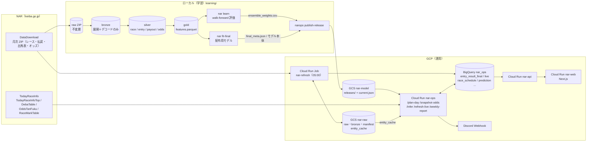

学習と運用をつなぐのは「モデルアーティファクトの契約」だけ（`manifest.json` + `feature_spec.json` + `standardizer.json` + モデル本体）。**特徴量の計算コードは共有**しており、運用側は `nar.features.builder.build()` と `nar.transform.keys` / `nar.transform.prerace` を直接 import する（書き直さない。SK-02）。

---

## 1. データ系譜（レイヤ図）

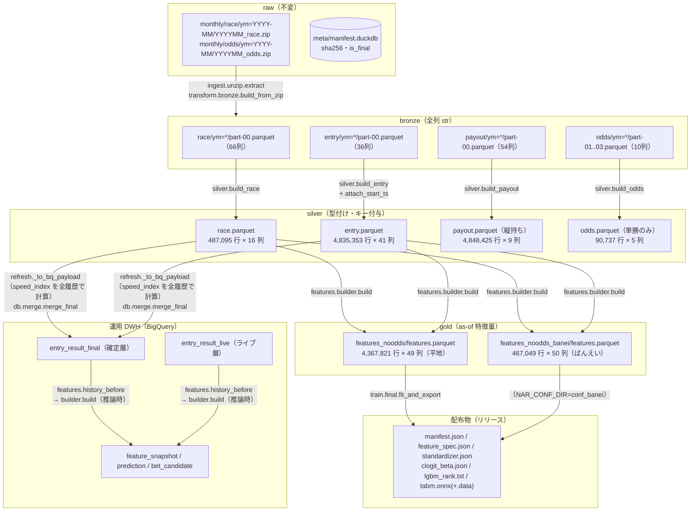

行数は `learning/data_real` の実測（2026-09-03 生成、gold の `content_hash` = `b50ea94e…` / `b49cf81f…` は現行リリースの `dataset_version` と一致）。

---

## 2. 学習系

### 2.1 CLI ステージのアクティビティ図

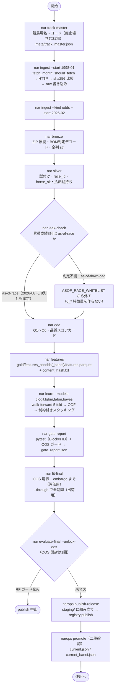

ばんえいは同じ流れを `NAR_CONF_DIR=conf_banei` で回す（`include.baba_codes=[1,2,3,4]`、`variant: banei`）。平地側は `exclude.baba_codes=[1,2,3,4]`。

### 2.2 ingest の確定判定（状態機械）

`nar.io.manifest.should_fetch` / `is_finalizable` / `finalize_pass` の挙動。

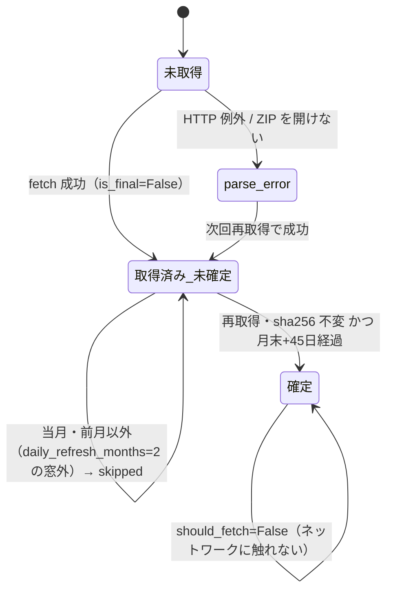

窓外に落ちた過去月は「不変の観測」が二度と起きないため、初回バックフィル分は `operation/scripts/finalize_history_backlog.py` で一度だけ全月を再確認して確定させた（`Design_Operation.md` §2.2）。

### 2.3 特徴量ビルダーの内部（`nar.features.builder.build`）

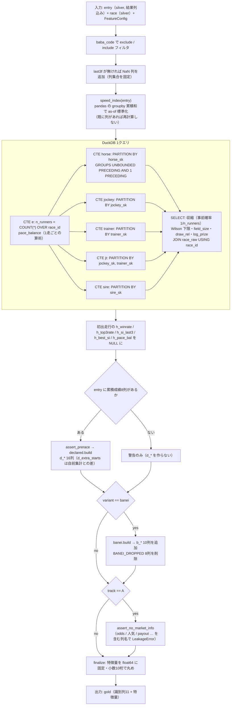

時点の正しさを担保する3点:

1. 集計フレームは `ORDER BY start_ts GROUPS BETWEEN UNBOUNDED PRECEDING AND 1 PRECEDING`。**同時刻の別場のレースも除外**する（`ROWS … EXCLUDE CURRENT ROW` ではそれが混ざる）。
2. `speed_index` の基準統計量も「同じ (場, 距離) で発走時刻が厳密に前」の行だけ（`peer` を引いて同時刻を外す）。
3. 当該レースの結果列（`finish_pos`, `time_sec`, `last3f`）は入力に含まれるが、ウィンドウから当該行が外れるので出力には漏れない（LK-05 が未来行を改ざんしてビット一致を検証）。

### 2.4 walk-forward 評価（`nar learn` → `train.pipeline`）のシーケンス

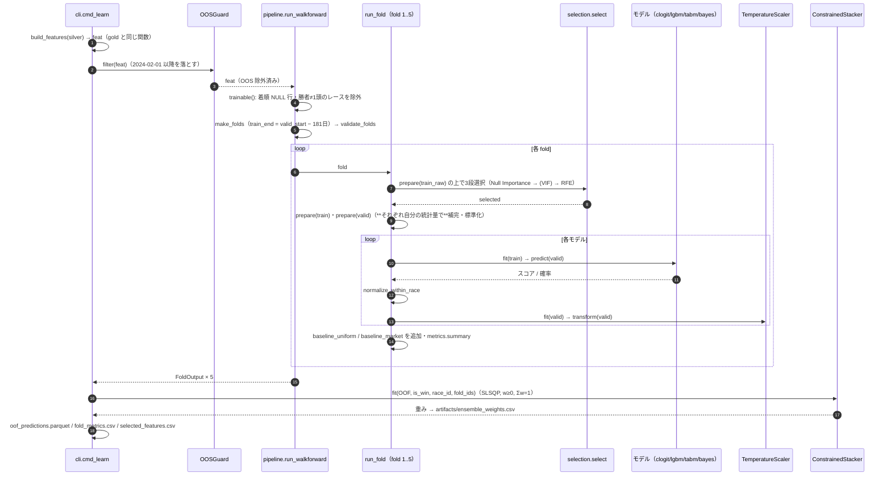

fold の境界（`conf/cv.yaml`、embargo は `max_lookback_days=180` から自動導出）:

| fold | train | valid |
|---|---|---|
| 1 | 1998-01-01 〜 2018-08-04 | 2019-02-01 〜 2019-12-31 |
| 2 | 1998-01-01 〜 2019-08-04 | 2020-02-01 〜 2020-12-31 |
| 3 | 1998-01-01 〜 2020-08-04 | 2021-02-01 〜 2021-12-31 |
| 4 | 1998-01-01 〜 2021-08-04 | 2022-02-01 〜 2022-12-31 |
| 5 | 1998-01-01 〜 2022-08-04 | 2023-02-01 〜 2023-12-31 |
| OOS | 1998-01-01 〜 2023-08-04 | 2024-02-01 〜 現在（施錠） |

（`train_end = valid_start − (embargo_days + 1)` 日。設計書 §9.1 の表は embargo 30日時代のもので、実装は 181 日前で切る。）

### 2.5 配布用モデルの学習（`nar fit-final` → `train.final.fit_and_export`）

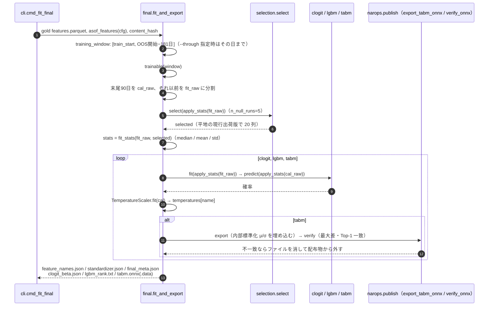

### 2.6 リリースと昇格（状態機械）

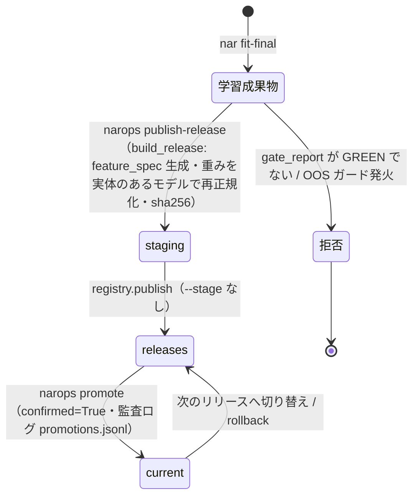

`manifest.json` に入る値の出どころ:

| manifest キー | 出どころ |
|---|---|
| `feature_spec.names` | `final_meta.json.feature_names`（fit-final の選択結果） |
| `ensemble_weights` | `artifacts/ensemble_weights.csv`（**walk-forward OOF** で推定。fit-final のモデルで再推定はしていない） |
| `calibration.temperature` | `final_meta.json.temperatures` のうち**重み最大のモデル**の温度（1つだけ） |
| `oos_metrics` | `artifacts/oos_metrics.json` の `ensemble`（評価用モデルで測った値） |
| `dataset_version` | gold の `content_hash` |
| `lookback_days` | `conf*/features.yaml` の `max_lookback_days` |
| `purpose` / `oos_evaluated_on` | `final_meta.json`（`--through` なら `production`） |

現行ポインタ（`operation/data/nar-model`、2026-09-16）: 平地 `current.json` = `v2026.09.05-B`（production、学習 1998-01-01〜2026-09-05、重み lgbm 0.059 / tabm 0.941、温度 0.9775）、ばんえい `current_banei.json` = `v2026.08.30-A-banei`（production、〜2026-08-24、lgbm 0.237 / tabm 0.763、温度 0.9853）。

---

## 3. 運用系

### 3.1 コンポーネント図

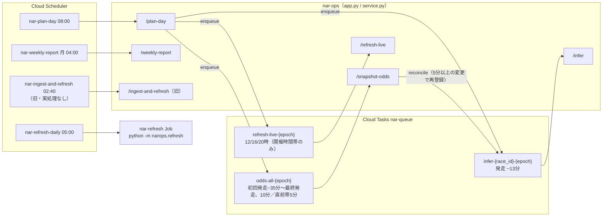

### 3.2 日次タイムライン

```mermaid
gantt
  title 開催日の1日（JST）
  dateFormat HH:mm
  axisFormat %H:%M
  section 確定層
  nar-refresh（実測 約11分半）       :done, r1, 05:00, 12m
  section 計画
  plan-day                          :milestone, p1, 08:00, 0m
  section 開催中（例: 初回 14:30, 最終 20:50）
  snapshot-odds（10分／直前5分）      :active, o1, 13:55, 415m
  infer（各レース 発走−13分）          :crit, i1, 14:17, 393m
  refresh-live 16:00                :milestone, l2, 16:00, 0m
  refresh-live 20:00                :milestone, l3, 20:00, 0m
```

`refresh-live` の 12:00 は、初回発走より前なら積まれない（`plan_live_refreshes` が `first ≤ fire ≤ last+30分` で絞る）。

### 3.3 `nar-refresh` Job（`narops.refresh.daily_refresh`）

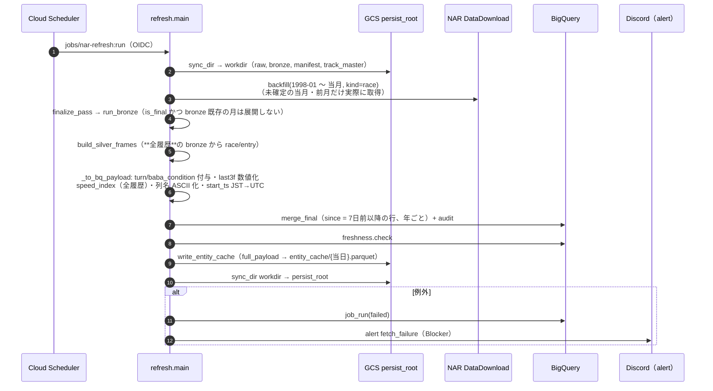

### 3.4 `/plan-day` と `/snapshot-odds`

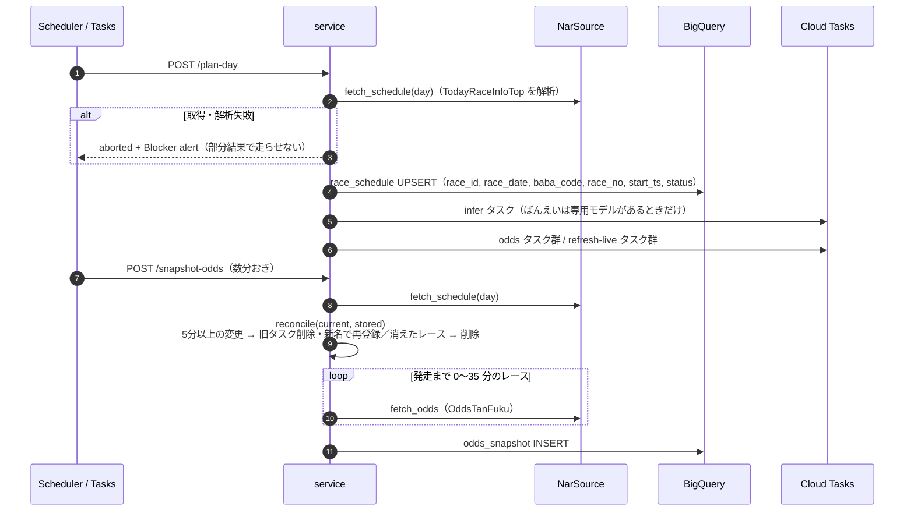

### 3.5 `/infer`（1レースの推論）

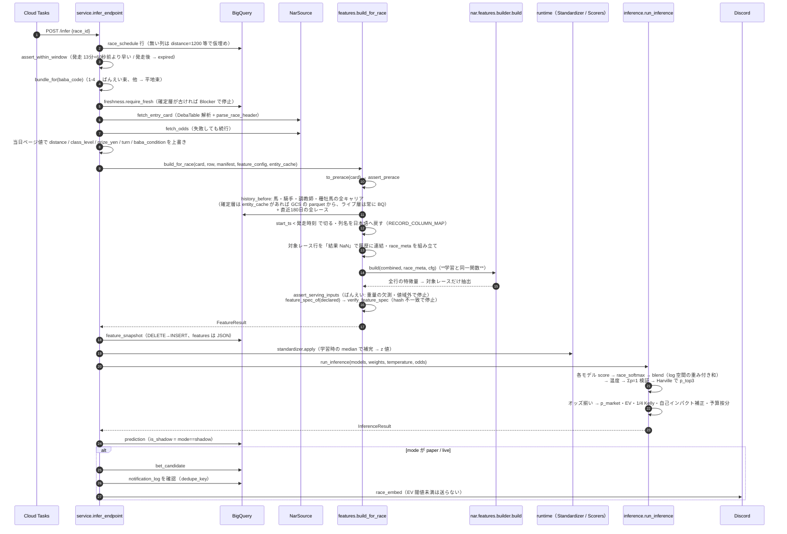

失敗時の分岐（`InferenceOutcome`）:

| 例外・状況 | status | リトライ | 通知 |
|---|---|---|---|
| スケジュールに無い | failed | — | — |
| 推論窓の外 / 発走後 | expired | しない | — |
| 確定層が古い（`StaleDataError`） | failed | — | Blocker |
| NAR 取得失敗（一般例外） | failed | **する**（retryable） | — |
| `InsufficientData` / `ZeroFillForbidden` / `NormalizationError` | insufficient_data | しない | Critical |

### 3.6 `/refresh-live` と `/weekly-report`

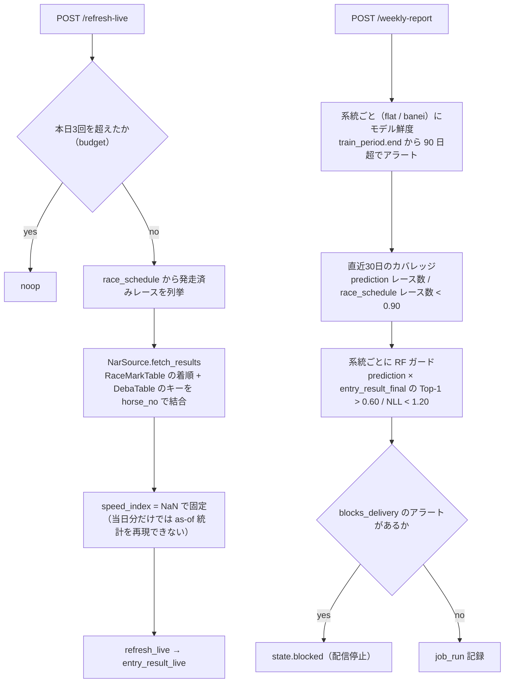

### 3.7 運用モード（状態機械、`narops.mode`）

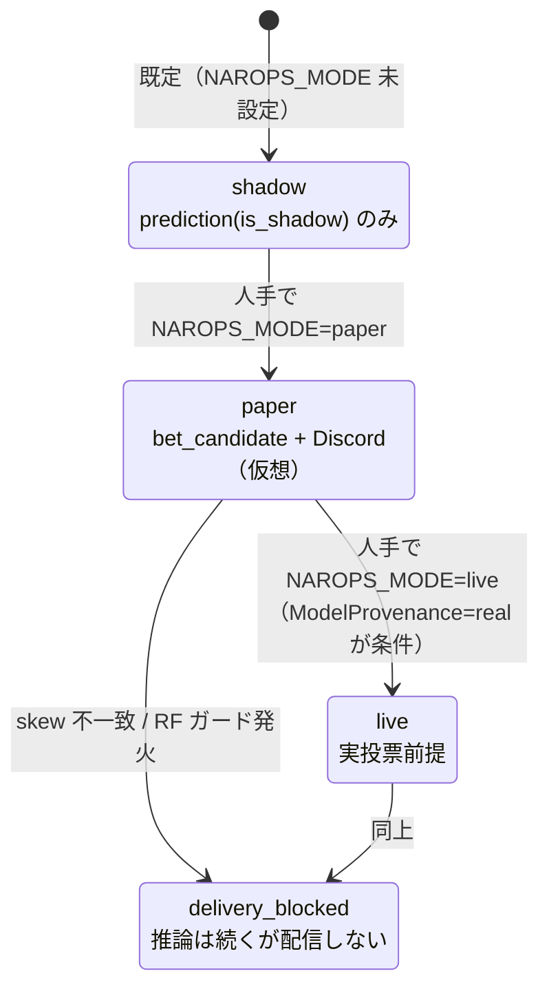

`nar-refresh` Job の環境変数は `NAROPS_MODE=paper`（`infra/services.json`）。

---

## 4. 学習と運用で共有するコード（クラス図）

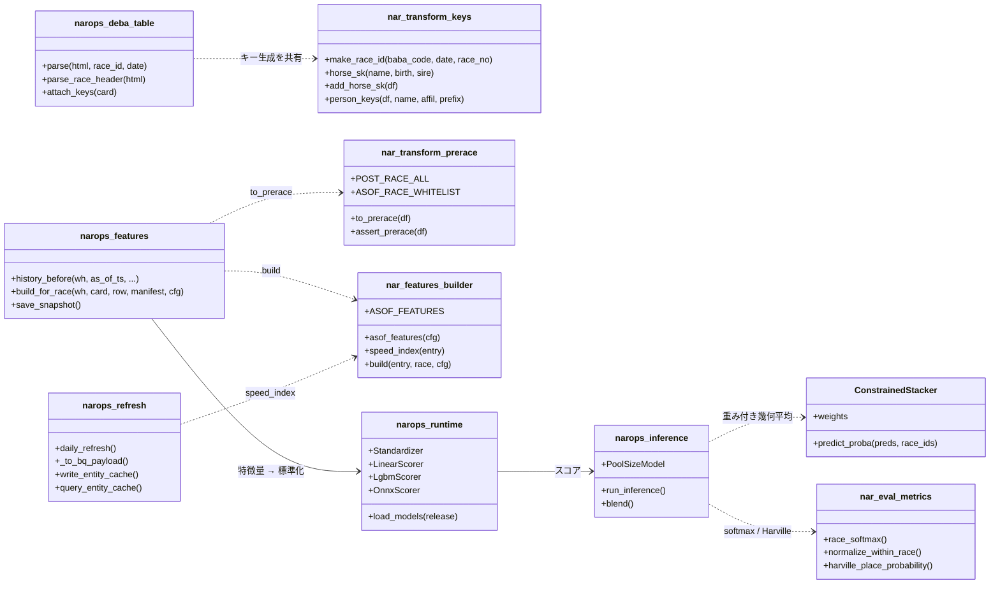

---

## 5. コードを追って分かった設計とのずれ（2026-09-16）

図を起こす過程で、既存の設計書の記述と実装が食い違っている箇所を確認した。#3 以外は**この文書の作成では修正していない**（挙動を変えるため、判断が要る）。

| # | 重要度 | 内容 | 根拠 |
|---|---|---|---|
| 1 | 高 | **本番の skew 検証は実質的に働いていない。** `Design_Operation.md` §2.4 は「前日分を確定層のみから再計算して snapshot と比較」と書くが、`service.ingest_and_refresh_endpoint` は `compare(snap, snap, …)` と**同じフレーム同士**を比較しており常に一致する。しかもこのエンドポイントは旧経路で、実処理の `nar-refresh` Job（`refresh.daily_refresh`）は skew 検証を呼ばない。`narops skew-check` CLI も `--recomputed` を渡さなければ snap 同士の比較になり、再計算値を作るコードは存在しない。 | `operation/src/narops/service.py:403`、`cli.py:428`、`refresh.py::daily_refresh` |
| 2 | 中 | skew の許容列 `j_wins_today` / `t_wins_today` / `track_speed_bias` は特徴量として存在しない（騎手・調教師の「当日成績」や馬場差の特徴量は未実装）。許容リストは空振りしている。 | `conf/ops.yaml` の `skew.tolerated_columns`、`builder.ASOF_FEATURES` |
| 3 | ~~中~~ **修正済み（2026-09-17）** | ~~較正の適用順が学習と推論で違う。walk-forward では**モデルごとに**温度をかけてから OOF で重みを推定するが、推論は**温度なしのモデル別 softmax を合成してから**、重み最大モデルの温度を1回だけかける。現行の温度は 0.95〜0.99 なので数値差は小さいが、手順は一致していない。~~ `Manifest` に `model_temperatures`（モデルごとの温度）を追加し、`narops/inference.py::run_inference` がこれを使って学習と同じ「モデルごとに較正 → アンサンブル」の順序に変更した。この dict が無い旧リリースは従来どおり合成後に1回だけ較正する経路にフォールバックする。本番（flat: v2026.09.17-C、banei: v2026.09.17-B-banei）に反映済み。 | `train/pipeline.py::run_fold`、`narops/inference.py::run_inference`、`narops/model/manifest.py::Manifest.model_temperatures`、`narops/publish.py::build_release` |
| 4 | 中 | 特徴量選択の第3段（RFE）の内部分割は `race_id` 順の 75/25。`race_id` は競馬場コード始まりなので**時系列ではなく場コードでの分割**になっている（同じ問題を `_fit_predict_bayes` は `start_ts` で並べ直して回避している）。 | `features/selection.py::select` |
| 5 | 低 | 申告値の収縮 `d_*_winrate` の事前確率は `0.1` 固定（`declared.build` に `prior_win=None` が渡る）。docstring の「出走頭数の逆数相当」とは違い、自前集計の収縮（`1/n_runners`）とも揃っていない。 | `features/builder.py:383`、`features/declared.py:80` |
| 6 | 低 | `class_level` は `_class_level` が 1〜5 を定義するが、実データの `class_name` は 普通/一般/特別/重賞/準重賞 の5値だけで、値は **2・4・5 しか出ない**。またレース内で定数なので、条件付きロジットではレース内 softmax で相殺される（配布物の係数は約 1e-17）。 | `silver.race` の実測、`clogit_beta.json` |
| 7 | 低 | 推論時の `history_before` は「直近 `lookback_days` 日の全レース」も取得するが、事前確率を `1/n_runners`（対象レースの頭数）に変えて以降、対象行の特徴量はこの断片に依存しない。取得の必要性は再確認の余地がある（削る前に `test_entity_cache.py` の等価性テストで確認すること）。 | `narops/features.py::history_before` の docstring 2番 |
| 8 | 低 | `Design_Modeling.md` §9.1 の fold 表は embargo 30 日の時代のもので、実装は 181 日前で train を切る（本書 §2.4 の表が現行値）。 | `eval/splits.py::make_folds` |
